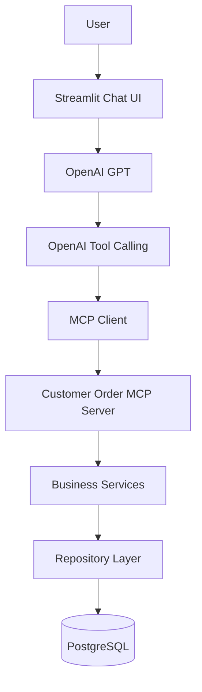
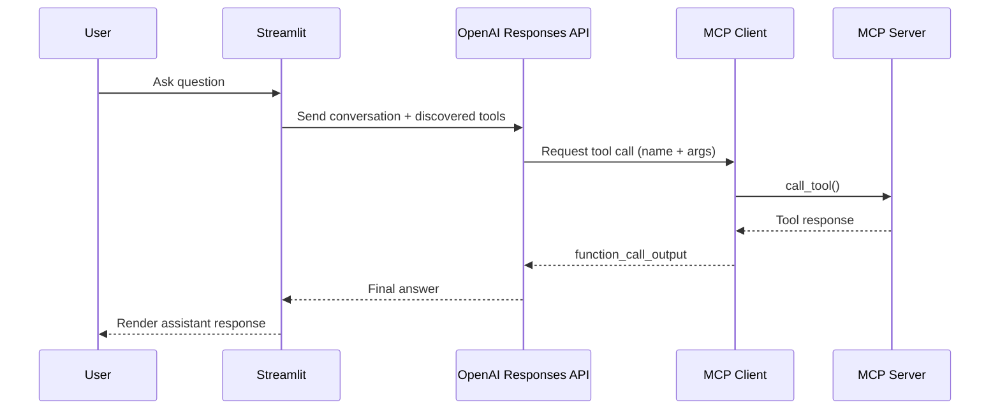

# Customer & Order Management MCP Server

A production-quality, beginner-friendly classroom project that demonstrates **all core MCP concepts** using a clean layered architecture and shared business logic.

This repository includes:
- A FastMCP server with tools, resources, and prompts
- A Streamlit dashboard for live classroom demonstrations
- An AI Customer Assistant page using OpenAI tool calling through MCP
- PostgreSQL with automatic migrations and seed data
- Docker Compose setup that works out of the box

## Project Overview

This project models a small customer/order domain and exposes it through three interfaces:
1. MCP interface for AI agents and MCP clients
2. Streamlit interface for instructors and students
3. OpenAI-powered chat assistant in Streamlit that calls MCP tools dynamically

All interfaces use the **same service layer** to avoid duplicated business logic.

## Architecture Diagram



## AI Chat Flow



## Folder Structure

```text
customer-order-mcp/
├── app.py
├── main.py
├── server.py
├── config.py
├── database.py
├── models.py
├── schemas.py
├── repositories.py
├── services.py
├── tools.py
├── resources.py
├── prompts.py
├── seed.py
├── requirements.txt
├── Dockerfile
├── docker-compose.yml
├── .env
├── .env.example
├── chat/
│   ├── __init__.py
│   ├── chatbot.py
│   ├── conversation.py
│   ├── openai_client.py
│   ├── prompt_builder.py
│   └── tool_executor.py
├── alembic.ini
├── README.md
├── migrations/
│   ├── env.py
│   ├── script.py.mako
│   └── versions/
│       ├── 0001_initial.py
│       └── 0002_sales_table.py
├── database/
└── screenshots/
```

## Database Schema

### Customers
- id
- name
- email (unique)
- phone
- city
- country
- status
- created_at

### Orders
- id
- customer_id (FK -> customers.id)
- product_name
- quantity
- unit_price
- total_price
- order_date

Relationship: one customer has many orders.

### Sales (Fact Table)
- id
- order_id (FK -> orders.id, unique)
- customer_id (FK -> customers.id)
- product_name
- quantity
- channel
- region
- currency
- status
- gross_amount
- discount_amount
- refund_amount
- net_amount
- cost_amount
- profit_amount
- sale_date

Relationships:
- one order maps to one sales fact row
- one customer maps to many sales fact rows

## MCP Concepts

### Tool
A tool performs an operation and may change data.
Examples: `create_customer`, `delete_order`, `update_customer`.

### Resource
A resource provides read-only, fetchable data snapshots.
Examples: `customer://all`, `orders://summary`.

### Prompt
A prompt provides reusable instruction templates for LLM workflows.
Examples: `Sales Summary`, `Generate Customer Email`.

## Implemented MCP Tools

### Customer Tools
- `search_customer(name)`
- `get_customer(customer_id)`
- `create_customer(name, email, phone, city, country, status)`
- `update_customer(customer_id, updates)`
- `delete_customer(customer_id)`
- `list_customers()`
- `customers_by_country(country)`
- `customers_by_status(status)`
- `count_customers()`
- `search_customer_email(email)`

### Order Tools
- `list_orders()`
- `get_order(order_id)`
- `customer_orders(customer_id)`
- `create_order(customer_id, product_name, quantity, unit_price)`
- `delete_order(order_id)`
- `recent_orders(days=30)`
- `highest_order()`
- `calculate_customer_total(customer_id)`

### Sales Tools
- `list_sales()`
- `sales_summary()`
- `generate_sales_insights()`

## Implemented MCP Resources

- `customer://all`
- `customer://active`
- `customer://countries`
- `customer://schema`
- `orders://all`
- `orders://recent`
- `orders://summary`
- `sales://all`
- `sales://summary`

## Implemented MCP Prompts

- `Customer Summary`
- `Sales Summary`
- `Inactive Customer Report`
- `Customer Lookup Assistant`
- `Generate Customer Email`
- `Generate Sales Insights`

## Validation and Error Handling

Validation uses Pydantic v2 and includes:
- Email format
- Phone format
- Required fields
- Positive IDs and numeric constraints
- Duplicate email protection

Handled errors:
- Validation errors
- Missing customer/order
- Duplicate email
- Invalid status and invalid IDs
- Unexpected DB/runtime failures

## Logging

Every MCP tool invocation is logged with:
- Timestamp
- Tool name
- Arguments
- Execution time
- Success/failure

## Docker Quick Start

### 1) Start everything

```bash
docker compose up --build
```

This starts:
- PostgreSQL
- MCP server
- Streamlit dashboard

### 2) Open Streamlit UI

- http://localhost:8501

### 3) MCP server endpoint

- http://localhost:8000/mcp
- Health check: http://localhost:8000/health

## Running Without Docker (optional)

```bash
python -m venv .venv
source .venv/bin/activate  # Linux/macOS
# .venv\Scripts\activate   # Windows PowerShell
pip install -r requirements.txt
python seed.py --migrate
python main.py
```

In another terminal:

```bash
streamlit run app.py
```

## Streamlit Pages

- Dashboard
- Customer Management
- Order Management
- Analytics
- AI Customer Assistant
- Agent Monitor
- Developer Tools
- MCP Playground
- Database Viewer

## AI Assistant Design

The AI Assistant is an extension layer. Existing MCP tools/resources/prompts/services/repositories remain unchanged.

- The chatbot does not access PostgreSQL directly.
- It discovers MCP tools from the server at runtime.
- OpenAI decides which tool to call (`tool_choice=auto`).
- Tool outputs are returned back to OpenAI as `function_call_output` items.
- The final answer is generated after a visible multi-stage execution pipeline.

### Execution Pipeline

For each user message, the assistant processes:

1. Conversation History
2. Conversation Summary
3. Intent Detection
4. Entity Extraction
5. Relevant Context
6. Prompt Construction
7. Planning
8. Supervisor Decision
9. Task Delegation
10. Agent Execution
11. Tool Selection
12. MCP Execution
13. Response Generation

All stages are shown in the Streamlit UI in Developer Mode.

### Prompt Templates

The assistant supports persona switching and dedicated pipeline prompt templates:

- Customer Assistant
- Sales Analyst
- Business Analyst
- Database Explorer

Prompt files are stored in:

- `chat/prompt_templates/system_prompt.txt`
- `chat/prompt_templates/summary_prompt.txt`
- `chat/prompt_templates/intent_prompt.txt`
- `chat/prompt_templates/entity_extraction_prompt.txt`
- `chat/prompt_templates/response_prompt.txt`

### Conversation Memory

The assistant maintains long-running memory in session state:

- Recent messages
- Conversation summary
- Previous tool calls
- Referenced customers
- Referenced orders

This supports follow-up questions like:

1. Show customers from Bangladesh
2. Which one spent the most?
3. Send me their email

### Educational Mode

The AI page includes a toggle: **Developer Mode**.

When enabled, students can inspect a complete execution panel:

- Stage-by-stage expanders for every pipeline step
- Execution timeline visualization
- Agent collaboration messages (Supervisor <-> Specialist agents)
- Planning card and execution order
- Tool request/response details and latency
- Prompt construction artifacts
- Intent/entity JSON
- Structured event log stream (`stage`, `planning`, `delegation`, `agent_execution`, `tool_call`, `error`)
- Assistant analytics (response time, intent distribution, tool usage, token usage)

This intentionally does not expose chain-of-thought.

### Pipeline Services

Reusable services are organized in:

- `chat/conversation_service.py`
- `chat/summary_service.py`
- `chat/intent_service.py`
- `chat/entity_service.py`
- `chat/prompt_service.py`
- `chat/chat_service.py`

## OpenAI and MCP Environment Variables

Add these to `.env`:

```env
OPENAI_API_KEY=your_key_here
OPENAI_MODEL=gpt-5-mini
OPENAI_TEMPERATURE=0.2
OPENAI_MAX_RETRIES=3
MCP_SERVER_URL=http://localhost:8000/mcp
```

In Docker Compose, Streamlit is configured to use:

- `MCP_SERVER_URL=http://mcp-server:8000/mcp`

## Running the AI Assistant

### Docker

```bash
docker compose up --build
```

Then open http://localhost:8501 and choose **AI Customer Assistant** from the sidebar.

### Local

1. Ensure MCP server is running on port 8000
2. Set `OPENAI_API_KEY`
3. Start Streamlit:

```bash
streamlit run app.py
```

## OpenAI Tool Calling Notes

- Tool schemas are read from MCP via `list_tools()`.
- Tool execution happens through MCP `call_tool()` only.
- No hardcoded MCP tool definitions are used for the assistant.
- Tool errors are returned to the model as structured outputs for graceful recovery.

## Logging for Teaching

AI assistant logs include:

- User prompt handoff
- Planner start/completion and planning duration
- Supervisor agent selection and delegation messages
- Specialist agent execution summaries
- Tool selected
- Tool arguments
- Execution time
- Tool response/error
- Final assistant response

### Log Locations in Streamlit

1. **AI Customer Assistant (Developer Mode)**
- Full stage JSON
- Timeline
- Plan + Delegation + Agent Outputs
- Agent Event Log (latest events table)
- Dedicated **Developer Tools** tab inside AI Customer Assistant with:
    - event-type filters
    - latest-N controls
    - tool-call trace panel
    - agent-output trace panel
    - downloadable assistant-specific log export

2. **Agent Monitor**
- Registered agents
- Agent status (`idle`/`running`/`completed`)
- Utilization and tool usage
- Latest collaboration and event entries

3. **Developer Tools**
- Filterable event stream by type
- JSON event payload inspection
- Downloadable event log export (`agent_event_log.json`)
- Session memory snapshots (plan, outputs, intermediate results, tool calls)

### Event Types

- `stage`: high-level pipeline stage transitions
- `planning`: planner lifecycle and plan metadata
- `delegation`: supervisor task assignment and collaboration messages
- `agent_execution`: specialist execution lifecycle
- `tool_call`: MCP tool invocation metadata per agent
- `error`: discovery/execution failures

## Sales Workflow (Detailed)

This section explains the full data and execution path for the new sales fact model.

### 1) Why add a sales fact table?

The orders table is good for transaction storage, but richer analytics usually require additional dimensions and normalized metrics per event. The sales table captures those explicitly:

- dimensions: channel, region, status, product_name
- metrics: gross, discount, refund, net, cost, profit
- timeline: sale_date

This supports better classroom demonstrations for KPI reporting and explainable AI analysis.

### 2) Migration lifecycle

Migration file:
- `migrations/versions/0002_sales_table.py`

What it does:
1. Creates `sales` with FK to `orders` and `customers`
2. Enforces unique `order_id` (one sales fact per order)
3. Adds indexes on analytical filters (`channel`, `region`, `status`, `sale_date`)
4. Provides a clean downgrade that drops indexes then table

Run migrations:

```bash
python seed.py --migrate
```

Inside Docker this is already handled by startup/seed flow.

### 3) Seed and backfill strategy

Source file:
- `seed.py`

Behavior:
1. If database is empty:
    - seeds customers
    - seeds orders
    - backfills one sales row for every order
2. If data already exists and no force reseed:
    - does not delete data
    - only backfills missing sales rows
3. If force reseed:
    - deletes sales first (FK-safe)
    - deletes orders
    - deletes customers
    - reseeds all tables

Backfill logic derives realistic training data:
- gross from order total
- randomized discount percent
- randomized status (`completed`, `pending`, `refunded`)
- refund based on refunded status
- net = gross - discount - refund
- cost as a bounded fraction of net
- profit = net - cost
- region derived from customer country

### 4) Repository layer for sales analytics

Source file:
- `repositories.py`

`SalesRepository` provides analytical primitives:
- `revenue_totals()` for gross/net/profit rollups
- `average_order_value()`
- `top_products(limit)`
- `top_regions(limit)`
- `channel_mix()`
- `monthly_trend(months)`

These methods keep SQL close to data access and out of UI/MCP glue code.

### 5) Service layer aggregation

Source file:
- `services.py`

`AnalyticsService` now accepts `SalesRepository` and exposes:
- `sales_summary()`
- `generate_sales_insights()`

`generate_sales_insights()` intentionally returns a default standard report scope so generic prompts such as “Generate sales insights” produce useful output without extra parameters.

### 6) MCP exposure for LLM tool calling

Source files:
- `tools.py`
- `resources.py`

New tools:
- `list_sales`
- `sales_summary`
- `generate_sales_insights`

New resources:
- `sales://all`
- `sales://summary`

Result: OpenAI tool calling can request deeper sales analytics through MCP instead of inferring from raw orders only.

### 7) Prompt layer alignment

Source file:
- `prompts.py`

Updated prompts now consume sales-fact outputs (`sales_summary` and `generate_sales_insights`) so generated narratives match the new analytics model.

### 8) End-to-end request flow for a sales question

Example user message:
- “Generate sales insights for the current dataset.”

Execution path:
1. Streamlit AI page sends the user turn to OpenAI Responses API
2. OpenAI chooses MCP tool call (`generate_sales_insights` or `sales_summary`)
3. MCP server routes call to `tools.py`
4. `ServiceFactory` builds repositories/services with one DB session
5. `AnalyticsService` fetches sales aggregates via `SalesRepository`
6. MCP returns structured JSON
7. OpenAI synthesizes final natural-language explanation
8. Streamlit displays final response plus stage-by-stage trace in Developer Mode

### 9) Example outputs

`sales_summary()` returns:
- sales_count
- gross_revenue
- discount_total
- refund_total
- net_revenue
- total_cost
- total_profit
- profit_margin_pct
- average_order_value

`generate_sales_insights()` returns:
- scope
- summary
- monthly_trend
- top_products
- top_regions
- channel_mix
- highlights

### 10) Verification checklist after pulling changes

1. Start stack: `docker compose up --build`
2. Confirm MCP health: `http://localhost:8000/health`
3. Confirm Streamlit loads: `http://localhost:8501`
4. In MCP Playground, call `sales_summary`
5. In AI page, ask: “Generate sales insights”
6. Verify Developer Mode shows tool call + response payload

## Testing: Example MCP Requests and Expected Responses

These are representative examples for classroom testing.

### Customer Tool Examples

1. `search_customer({"name":"Ava"})`
Expected: `{"customers":[{"id":1,"name":"Ava Johnson",...}]}`

2. `get_customer({"customer_id":1})`
Expected: one customer object with `id=1`.

3. `create_customer({...})`
Expected: created customer object with new `id`.

4. `update_customer({"customer_id":1,"updates":{"city":"Seattle"}})`
Expected: customer object with updated city.

5. `delete_customer({"customer_id":1})`
Expected: `{"deleted":true,"customer_id":1}`

6. `list_customers({})`
Expected: `{"customers":[...]}` with at least 20 records initially.

7. `customers_by_country({"country":"USA"})`
Expected: `{"customers":[...USA customers...]}`

8. `customers_by_status({"status":"active"})`
Expected: `{"customers":[...active customers...]}`

9. `count_customers({})`
Expected: `{"count":20}` (before manual changes).

10. `search_customer_email({"email":"ava.johnson@example.com"})`
Expected: one matching customer object.

### Order Tool Examples

11. `list_orders({})`
Expected: `{"orders":[...]}`

12. `get_order({"order_id":1})`
Expected: one order object.

13. `customer_orders({"customer_id":1})`
Expected: all orders for customer 1.

14. `create_order({"customer_id":1,"product_name":"Tablet","quantity":2,"unit_price":399.99})`
Expected: new order object with computed `total_price`.

15. `delete_order({"order_id":1})`
Expected: `{"deleted":true,"order_id":1}`

16. `recent_orders({"days":30})`
Expected: orders within recent 30 days.

17. `highest_order({})`
Expected: `{"order":{...largest total_price...}}`

18. `calculate_customer_total({"customer_id":1})`
Expected: `{"customer_id":1,"total":"..."}`

## MCP Inspector / Claude Desktop / Cursor

Use the MCP server URL:
- `http://localhost:8000/mcp`

If your MCP client requires streamable HTTP transport, this project is configured for it by default.

## Troubleshooting

1. Ports already in use
- Change host port mappings in `docker-compose.yml`.

2. DB connection issues
- Confirm `.env` matches compose service names (`POSTGRES_HOST=postgres`).

3. Migration errors
- Rebuild containers: `docker compose down -v` then `docker compose up --build`.

4. Streamlit shows no data
- Check `mcp-server` logs to confirm seed/migrations completed.
